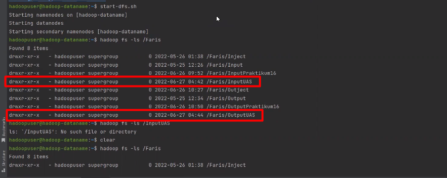
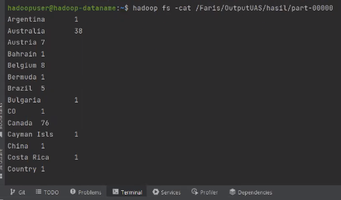
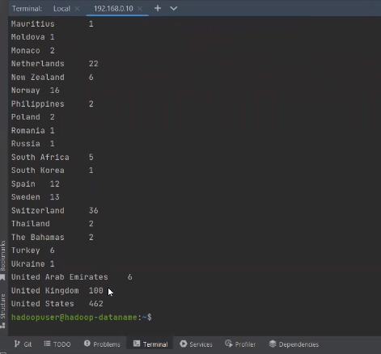

# Hadoop UAS Big Data MAP - REDUCE (Data Penjualan dan Credit Card)
---------------------------------------
> Dosen Pengampu  
> Dian Hanifudin Subhi, S.Kom., M.Kom.
---------------------------------------
Country Sales Data Use Credit Card and Home Sales
--------------------------
> Faris Ikhlasul Haq  
> 1941720062 / 06  
> TI - 3A   
--------------------------
### Studi Kasus
Data yang didapat dari kaggle dengan nama Online Product Sales, data tersebut yang berisikan data penjualan berbagai negara, data transaksi, tipe pembayaran, harga, kota, Provinsi, Negara, dan lain lain. Jadi pada permasalahannya akan dibuat adalah menjumlahkan / sum dari beberapa data tiap negara yang.

### File .csv
https://drive.google.com/drive/folders/1RT-6rqvLuVHflXN7_OYyfE2Zkj-LO5Zt?usp=sharing

### Hasil Mapreduce Hadoop

### Youtube Link
https://youtu.be/HN593yE4TMk
